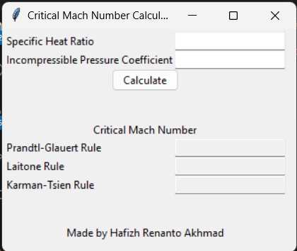
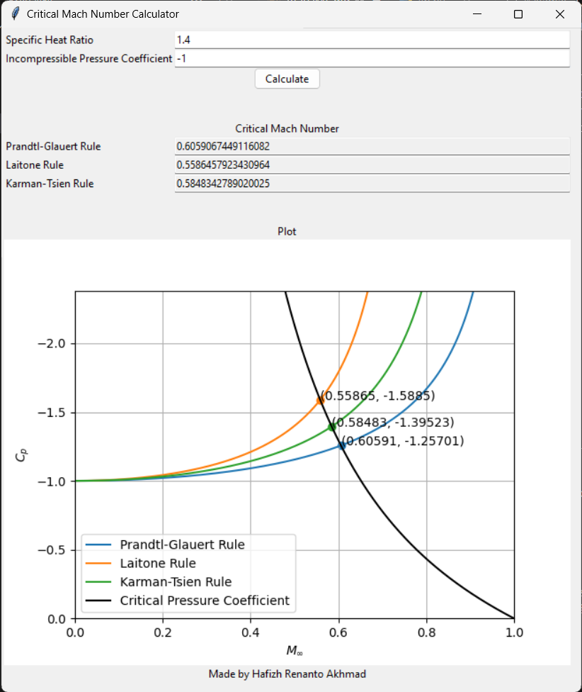

# Critical Mach Number Calculator

## Theory

Using linearized compressible flow theory, the compressible Mach number $M$ is related to the incompressible Mach number $M_o$ by the following equations:

- Prandtl-Glauert Rule
  $$
  C_p = \frac{C_{p_o}}{\sqrt{1 - M_\infty^2}}
  $$
- Laitone Rule
  $$
  C_p = \frac{C_{p_o}}{\sqrt{1-M_\infty^2} + \frac{M_\infty^2 \left(1 + \frac{\gamma-1}{2}M_\infty^2\right)}{\sqrt{1-M_\infty^2}} \frac{C_{p_o}}{2}}
  $$
- Karman-Tsien Rule
  $$
  C_p = \frac{C_{p_o}}{\sqrt{1-M_\infty^2} + \frac{M_\infty^2}{1 + \sqrt{1-M_\infty^2}} \frac{C_{p_o}}{2}}
  $$

The critical Mach number of a flow over an airfoil at a subsonic speed is the Mach number at which the local flow velocity at the minimum pressure point on the airfoil reaches the speed of sound, related with the compressible pressure coefficient $C_p$ by the following equation:

$$
C_{p_\text{cr}} = \frac{2}{\gamma M_\text{cr}^2} \left[\left(\frac{1 + \frac{\gamma-1}{2} M_\text{cr}^2}{1 + \frac{\gamma-1}{2}}\right)^{\gamma/\left(\gamma-1\right)}- 1\right]
$$

Given a value of incompressible Mach number $C_{p_o}$ and a value of the ratio of specific heats $\gamma$, the critical Mach number $M_\text{cr}$ can be calculated by finding the roots of difference between the compressible pressure coefficient $C_p$ and the critical pressure coefficient $C_{p_\text{cr}}$.

## Algorithm

A numerical method is used to find the roots of the difference between the compressible pressure coefficient $C_p$ and the critical pressure coefficient $C_{p_\text{cr}}$, that is, the bisection method. The bisection method is a root-finding method that repeatedly bisects an interval and then selects a subinterval in which a root must lie for further processing.

## Usage

The following packages are required to run the program:

- numpy
- matplotlib

To run the program, first download and extract the repository or clone it with

```
git clone https://github.com/hafizh-ender/hw-aero1-critical-mach-number
```

Then, simply run the following command in the terminal:

```bash
python main.py
```

If the program is run successfully, the following figure will be generated:


The program will ask for the value of incompressible Mach number $C_{p_o}$ and the value of the ratio of specific heats $\gamma$. After entering the values and pressing the `Calculate` key, the program will calculate the critical Mach number $M_\text{cr}$ and plot the critical Mach number curve.



If somehow the program fails to run, please check the folder `junk` and open the `prototype.ipynb`. Insert the desired values of $C_{p_o}$ and $\gamma$ in the first cell, and run the second cell to get the critical Mach numbers $M_\text{cr}$. To plot the critical Mach number curve, run the fourth cell.
